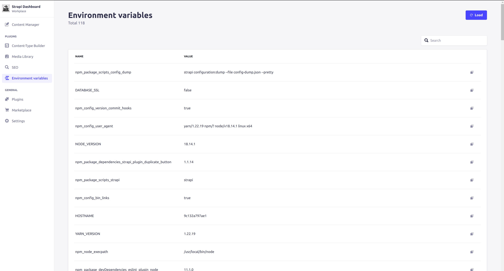

<div align="center">
  
  <h1>Strapi Environment Variables</h1>
  <p>Plugin for Strapi SMS, which allows you to view and copy environment variables with which the backend is running.</p>
  
</div>

## Get Started

* [Features](#features)
* [Installation](#installation)
* [Configuration](#configuration)

## <a id="features"></a>✨ Features
* Adds a page where you can view all the environment variables that are available on the system.
* Any variable and its value can be copied by pressing one button.

## <a id="installation"></a>💎 Installation
```bash
yarn add strapi-plugin-environment-variables@latest
```

Don't forget to **restart or rebuild** your Strapi app when installing a new plugin.

## <a id="configuration"></a>🔧 Configuration

```js
// ./config/plugins.ts
export default ({ env }) => ({
  'environment-variables': {
    enabled: true,
  },
});
```

Finally, don't forget to enable your plugin in your app by adding it to `config/plugins.ts`.
